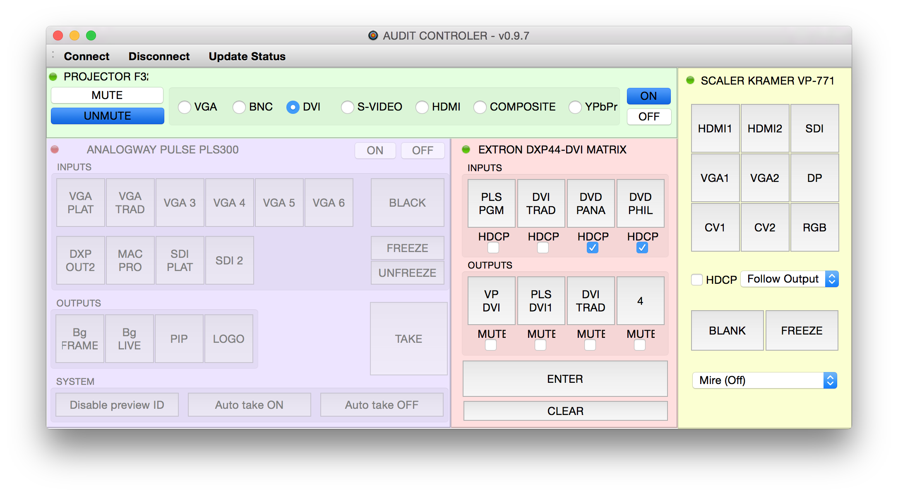

auditControl
============

Graphical user interface for controling audiovisual devices over TCP : 
- scaler Analogway Pulse PLS200
- DVI Matrix Extron DXP44-DVI
- Projection Design F32+ video projector
- scaler Kramer VP771

Developped in C++ using Qt framework 5.1.1 and Qt Creator 2.8.1 under Mac OsX Yosemite.

This software is free to modify and redistribute.

Please enclose source code when redistributing.

Feel free to contribute.

License
-------

auditControl - Graphical user interface for controling audiovisual devices

Martial GALLORINI (http:/martialgallorini.github.io/)

This program is free software: you can redistribute it and/or modify
it under the terms of the GNU General Public License as published by
the Free Software Foundation, either version 3 of the License, or
(at your option) any later version.

This program is distributed in the hope that it will be useful,
but WITHOUT ANY WARRANTY; without even the implied warranty of
MERCHANTABILITY or FITNESS FOR A PARTICULAR PURPOSE. See the
GNU General Public License for more details.

You should have received a copy of the GNU General Public License 
along with this program.  If not, see <http://www.gnu.org/licenses/>.
